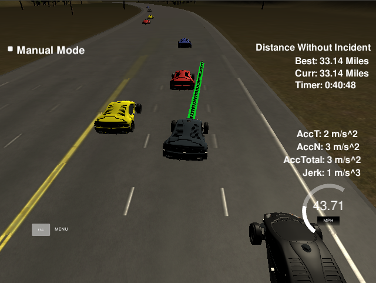

# CarND-Path-Planning-Project
Self-Driving Car Engineer Nanodegree Program

---



## Description
In this project, a path planner is constructed to make a car drive smoothly and autonomously on a 3 lane highway with traffic. The path planner is able to keep inside its lane, avoids hitting other cars, and passes slower moving traffic all by using localization, sensor fusion, and map data provided by the car simulator.

## Method
For each time step, the simulator provides localization data of our car as well as all other cars in its vicinity.
Based on the current location of our car, we generate a number of trajectory proposals.
Each trajectory can take one of three lane states:
1) Keep Lane (KL)
2) Lane Change Left (LCL)
3) Lane Change Right (LCR)

If the car is in the leftmost lane, we remove LCL as an option. Similarly, if the car is in the rightmost lane, we remove LCR as an option.

For each of the feasible states, 3 proposed trajectories are generated.
One with the current velocity of our car, one with a slightly increased velocity, and one with a slightly decreased velocity.
Velocities below 0 and velocities above the speed limit are of course not proposed.
In total, we can therefore have 9 proposed trajectories (3 for KL, 3 for LCL, and 3 for LCR).

The overall goal of the path planner is to choose the best of these trajectories and execute it in the simulator.
The generation of each trajectory further has to make it smooth (not violating maximum jerk and acceleration values), not violate the speed limit, and stay inside the planned lane.

Below, each of the steps in the chain is described in more detail.

### Trajectory Generation
First, each of the 9 proposed trajectories needs to be generated.
A single proposed trajectory is characterized by 2 parameters:
1) *velocity*: 0-50 mph
2) *lane*: 0 (left lane), 1 (center lane), or 2 (right lane)

A spline is used to represent the trajectory.
It ensures a smooth path and can indirectly handle issues related to high values of sideways acceleration and jerk.
A number of waypoints are generated that the spline must go through.
In order to ensure a smooth transition from the previous planned path, we extend the previous path given to simulator.
The waypoints used for the spline are therefore:
1) The second to last point (x,y) given to the simulator.
2) The last point (x,y) given to the simulator.
3) A waypoint on the desired *lane* 50m ahead of us.
4) A waypoint on the desired *lane* 100m ahead of us.
5) A waypoint on the desired *lane* 150m ahead of us.

Waypoints 1 and 2 are already in global (x,y) coordinates. 
Waypoints 3-5, however, are first defined in Frenet (s,d) coordinates, as this significantly eases the definition. For waypoint 3, we have:
- `s = car_s + 50`
- `d = 2 + 4 * *lane*`    (as the lanes are 4 meters wide and we want the car to be in the center of *lane*)

Waypoints 3-5 are then converted to global (x,y) coordinates using the function *getXY()* provided by Udacity.
Before defining the spline, we convert all waypoints to local (x,y) coordinates in the vehicle frame.
This is done with a translation and rotation, using the heading angle of the car.
Finally, the spline, *s*, is defined using the transformed waypoints. A [C++ spline tool](http://kluge.in-chemnitz.de/opensource/spline/) is used that allows us to easily evaluate function values (sample points along the spline).

In order to ensure a smooth path, we want to sample *N_path=50* points along the spline with equal spacing, corresponding to the desired *velocity* of the proposed trajectory.
This is done by using a linear approximation between waypoint 2 and 3. This method has been adapted directly from the Udacity Project Walkthrough.
As the local vehicle coordinate of waypoint 2 is simply `(0,0)` and for waypoint 3 `(50,s(50))`, the distance between waypoint 2 and 3 is `dist = sqrt(50*50+s(50)*s(50))`.
Therefore, the `n`th point along the trajectory will have local vehicle coordinates:
- `x = 50/dist * 0.02 * *velocity*/2.24`     (where 0.02 is the time cycle of the simulator, and 2.24 is a conversion from mph to m/s)
- `y = s(x)`
Finally, the coordinates are converted back to global map coordinates.
This concludes the generation of the proposed trajectory.

In order to plan far ahead along the highway, but only execute a short path for each time step, we actually generate two versions of the proposed trajectory:
1) Executable path: has a short horizon and is used for controlling the vehicle
2) Planned path: has a long horizon and is used for planning into the future and for comparing the different proposed trajectories.


All trajectories start at the current position of the car. 

---
   
### Simulator.
You can download the Term3 Simulator which contains the Path Planning Project from the [releases tab (https://github.com/udacity/self-driving-car-sim/releases).

### Goals
In this project your goal is to safely navigate around a virtual highway with other traffic that is driving +-10 MPH of the 50 MPH speed limit. You will be provided the car's localization and sensor fusion data, there is also a sparse map list of waypoints around the highway. The car should try to go as close as possible to the 50 MPH speed limit, which means passing slower traffic when possible, note that other cars will try to change lanes too. The car should avoid hitting other cars at all cost as well as driving inside of the marked road lanes at all times, unless going from one lane to another. The car should be able to make one complete loop around the 6946m highway. Since the car is trying to go 50 MPH, it should take a little over 5 minutes to complete 1 loop. Also the car should not experience total acceleration over 10 m/s^2 and jerk that is greater than 50 m/s^3.

#### The map of the highway is in data/highway_map.txt
Each waypoint in the list contains  [x,y,s,dx,dy] values. x and y are the waypoint's map coordinate position, the s value is the distance along the road to get to that waypoint in meters, the dx and dy values define the unit normal vector pointing outward of the highway loop.

The highway's waypoints loop around so the frenet s value, distance along the road, goes from 0 to 6945.554.

## Basic Build Instructions

1. Clone this repo.
2. Make a build directory: `mkdir build && cd build`
3. Compile: `cmake .. && make`
4. Run it: `./path_planning`.

Here is the data provided from the Simulator to the C++ Program

#### Main car's localization Data (No Noise)

["x"] The car's x position in map coordinates

["y"] The car's y position in map coordinates

["s"] The car's s position in frenet coordinates

["d"] The car's d position in frenet coordinates

["yaw"] The car's yaw angle in the map

["speed"] The car's speed in MPH

#### Previous path data given to the Planner

//Note: Return the previous list but with processed points removed, can be a nice tool to show how far along
the path has processed since last time. 

["previous_path_x"] The previous list of x points previously given to the simulator

["previous_path_y"] The previous list of y points previously given to the simulator

#### Previous path's end s and d values 

["end_path_s"] The previous list's last point's frenet s value

["end_path_d"] The previous list's last point's frenet d value

#### Sensor Fusion Data, a list of all other car's attributes on the same side of the road. (No Noise)

["sensor_fusion"] A 2d vector of cars and then that car's [car's unique ID, car's x position in map coordinates, car's y position in map coordinates, car's x velocity in m/s, car's y velocity in m/s, car's s position in frenet coordinates, car's d position in frenet coordinates. 

## Details

1. The car uses a perfect controller and will visit every (x,y) point it recieves in the list every .02 seconds. The units for the (x,y) points are in meters and the spacing of the points determines the speed of the car. The vector going from a point to the next point in the list dictates the angle of the car. Acceleration both in the tangential and normal directions is measured along with the jerk, the rate of change of total Acceleration. The (x,y) point paths that the planner recieves should not have a total acceleration that goes over 10 m/s^2, also the jerk should not go over 50 m/s^3. (NOTE: As this is BETA, these requirements might change. Also currently jerk is over a .02 second interval, it would probably be better to average total acceleration over 1 second and measure jerk from that.

2. There will be some latency between the simulator running and the path planner returning a path, with optimized code usually its not very long maybe just 1-3 time steps. During this delay the simulator will continue using points that it was last given, because of this its a good idea to store the last points you have used so you can have a smooth transition. previous_path_x, and previous_path_y can be helpful for this transition since they show the last points given to the simulator controller with the processed points already removed. You would either return a path that extends this previous path or make sure to create a new path that has a smooth transition with this last path.

## Tips

A really helpful resource for doing this project and creating smooth trajectories was using http://kluge.in-chemnitz.de/opensource/spline/, the spline function is in a single hearder file is really easy to use.

---

## Dependencies

* cmake >= 3.5
 * All OSes: [click here for installation instructions](https://cmake.org/install/)
* make >= 4.1
  * Linux: make is installed by default on most Linux distros
  * Mac: [install Xcode command line tools to get make](https://developer.apple.com/xcode/features/)
  * Windows: [Click here for installation instructions](http://gnuwin32.sourceforge.net/packages/make.htm)
* gcc/g++ >= 5.4
  * Linux: gcc / g++ is installed by default on most Linux distros
  * Mac: same deal as make - [install Xcode command line tools]((https://developer.apple.com/xcode/features/)
  * Windows: recommend using [MinGW](http://www.mingw.org/)
* [uWebSockets](https://github.com/uWebSockets/uWebSockets)
  * Run either `install-mac.sh` or `install-ubuntu.sh`.
  * If you install from source, checkout to commit `e94b6e1`, i.e.
    ```
    git clone https://github.com/uWebSockets/uWebSockets 
    cd uWebSockets
    git checkout e94b6e1
    ```

## Editor Settings

We've purposefully kept editor configuration files out of this repo in order to
keep it as simple and environment agnostic as possible. However, we recommend
using the following settings:

* indent using spaces
* set tab width to 2 spaces (keeps the matrices in source code aligned)

## Code Style

Please (do your best to) stick to [Google's C++ style guide](https://google.github.io/styleguide/cppguide.html).

## Project Instructions and Rubric

Note: regardless of the changes you make, your project must be buildable using
cmake and make!


## Call for IDE Profiles Pull Requests

Help your fellow students!

We decided to create Makefiles with cmake to keep this project as platform
agnostic as possible. Similarly, we omitted IDE profiles in order to ensure
that students don't feel pressured to use one IDE or another.

However! I'd love to help people get up and running with their IDEs of choice.
If you've created a profile for an IDE that you think other students would
appreciate, we'd love to have you add the requisite profile files and
instructions to ide_profiles/. For example if you wanted to add a VS Code
profile, you'd add:

* /ide_profiles/vscode/.vscode
* /ide_profiles/vscode/README.md

The README should explain what the profile does, how to take advantage of it,
and how to install it.

Frankly, I've never been involved in a project with multiple IDE profiles
before. I believe the best way to handle this would be to keep them out of the
repo root to avoid clutter. My expectation is that most profiles will include
instructions to copy files to a new location to get picked up by the IDE, but
that's just a guess.

One last note here: regardless of the IDE used, every submitted project must
still be compilable with cmake and make./

## How to write a README
A well written README file can enhance your project and portfolio.  Develop your abilities to create professional README files by completing [this free course](https://www.udacity.com/course/writing-readmes--ud777).

